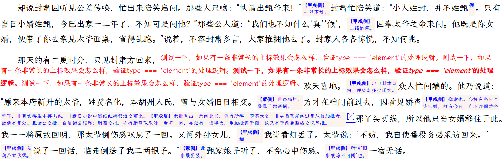

# 说明

- `DualAnnoLayout`类是一个HTML中文古籍双行夹批排版引擎，模拟 `Word`双行合一的*流式双行绕接*方式排版。获取元素内容宽度时使用 `Canvas API`中的 `measureText`方法进行测量，而未使用 `DOM API`。
- 使用 `DualAnnoLayout`时，应当将需要进行双行排版处理的段落以双行夹批形式排版的内容包装在具有某个指定 `CSS`类名的 `HTML`元素中，并将具体的类名通过构造函数的 `option`参数传递给 `DualAnnoLayout`。
- `DualAnnoLayout`类构造函数参数说明：

  - element： 需要进行双行夹批排版处理的 `HTML`元素，通常为文中的一个段落；
  - option： 一些自定义选项组成的对象，这些选项均有默认值，因此创建 `DualAnnoLayout`类的实例时也可以不提供。选项包括下列项目：
    - noHeading：不得在行首出现的字符，默认值为 `!%),.:;>?]}¢¨°·ˇˉ―‖’”…‰′″›℃∶、。〃〉》」』】〕〗〞︶︺︾﹀﹄﹚﹜﹞！＂％＇），．：；？］｀｜｝～￠`，复制自 `Word`选项；
    - noTailing：不得在行尾出现的字符，默认值为 `$([{£¥·‘“〈《「『【〔〖〝﹙﹛﹝＄（．［｛￡￥`，复制自 `Word`选项；
    - minAnnoChars：对较长的批注进行拆分时，拆分出来的一条独立的双行夹批最小长度，默认值为 `2`。如果批注本身长度小于此值，不会影响排版；
    - rightAdjust：文档内容容器右边空出来的像素值，用于计算单行有效宽度时预留以容纳测量误差，默认值为 `5px`；
    - annoClass：容纳双行夹批内容的 `HTML`元素的 `CSS `类名，默认为 `annotation`。
    - moveForIlleChar：出现行首或行尾非法字符时最多移动多少个字符以使非法字符不再位于行首或行尾，默认值为 `3`。
- 在 `HTML`页面中调用 `DualAnnoLayout`类的方式：

  - 当夹批数量较少时，可以用如下方式调用：

    ```javascript
    window.onload = () => {
        // 页面加载完成后，一次对所有 class 为 dual-layout 的标签重排为双行合一，适用于大多数情况
        DualAnnoLayout.activate('.dual-layout', {minAnnoChars:4,});
    }
    ```
  - 当夹批数量较多导致浏览器卡顿，可以用如下方式调用：

    ```javascript
    window.onload = () => {
        // 一次性重排行数过多导致页面加载耗时过久，可改用通过视口监听器仅在需要重排的内容进入视口时才重排
        const observer = new IntersectionObserver(es => es.forEach(e => {
            if (e.isIntersecting) {
                if (!e.target.DualAnnoLayout) {
                    e.target.DualAnnoLayout = new DualAnnoLayout(e.target, {minAnnoChars:4,});
                    e.target.DualAnnoLayout.render();
                } else {
                    e.target.DualAnnoLayout.render();
                }
            }
        }));
        document.querySelectorAll('.dual-layout').forEach(el => observer.observe(el));
    }
    ```
- `demo.html`为调用 `DualAnnoLayout`类的示例文件，其排版效果局部截图如下：
  
